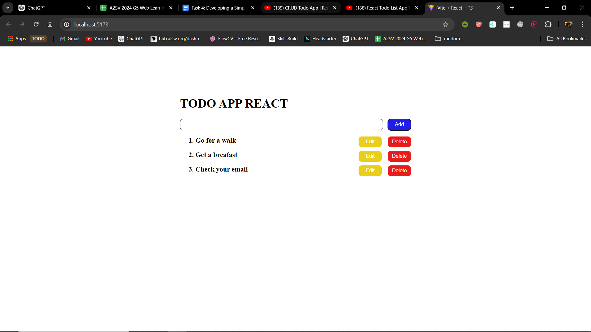
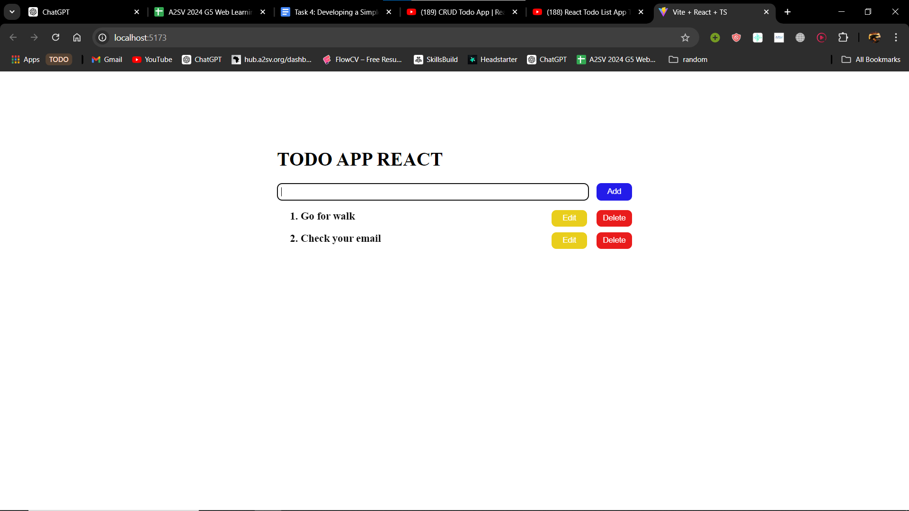
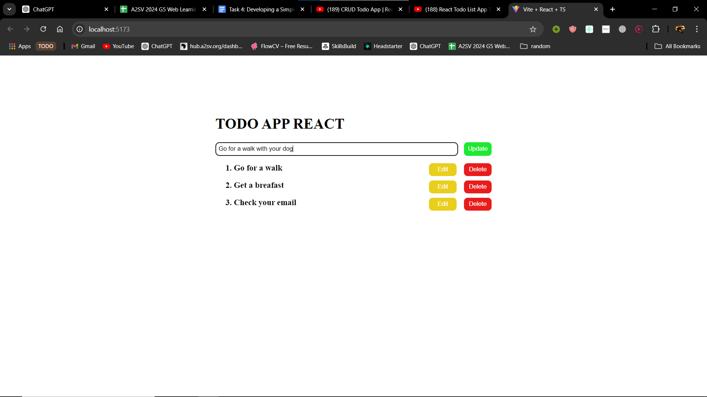

# TODO APP using React + TypeScript + Vite

- This is a todo app that have the following functionality
    * Add
        - By entering task in the input it will add to the list.
        -  
     
    * Delete
        - 
    * Update
        - When clicking the update button it will prepopulate the input then update the input.
        - 
