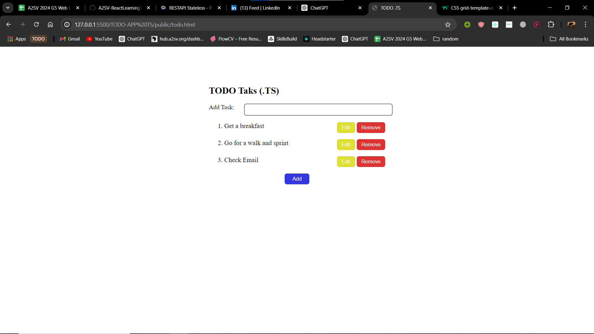
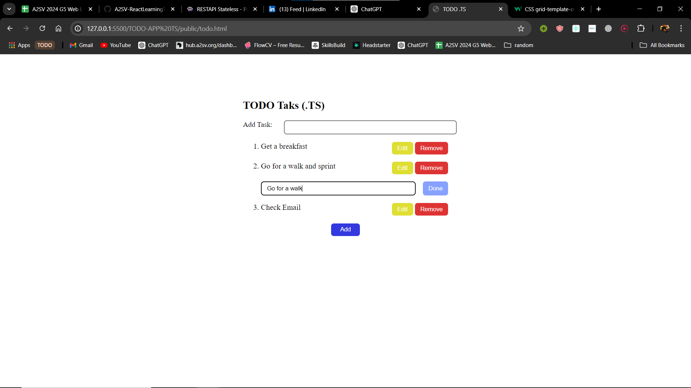
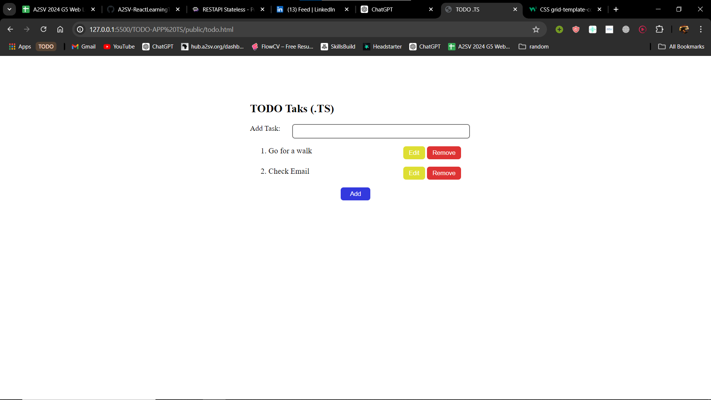

  ## Prerequirments: 
      Python 2.8+
  ## Installation:
      git clone https://github.com/TNAHOM/Project-JS.git
      cd <specific folder to run>

# Description
  This is a todo project using Typescript that have the following functionality: Add, Edit and remove
  * Add function
    - Add task and press Add button.
    - 
  * Edit function
    - Its a dynamic edit function. After pressing the button it will display an input text that is prefilled by the task then you edit, finally click DONE.
    - 
  * Remove function
    - When the button is clicked it will remove the task.
    - 
