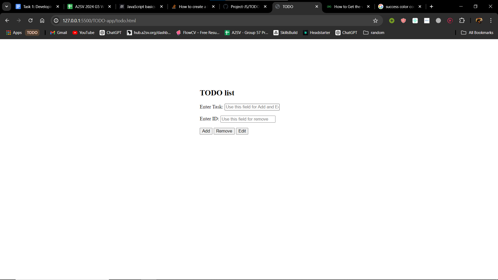
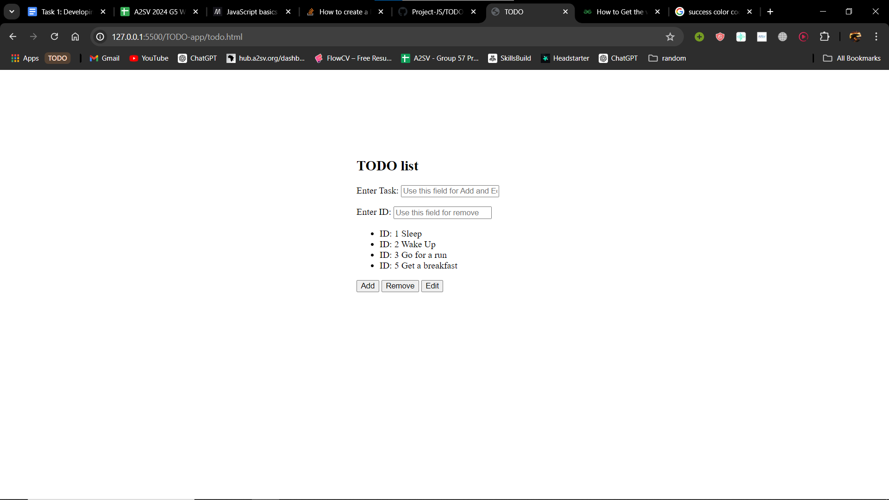

# Getting Started
  ## Prerequirments: 
      Python 2.8+
  ## Installation:
      git clone https://github.com/TNAHOM/Project-JS.git
      cd <specific folder to run>

# Description
  This is a todo project that have the following functionality: Add, Edit and remove
  * Add function
      - In the enter task field add your task then click add button.
  * Edit
      - Enter the ID of the needed task to edit.
      - And also add a text to which its going to be rewritten.
   
  * Remove
      - In order to remove a specific text add the ID of the needed text.
   
    
    
