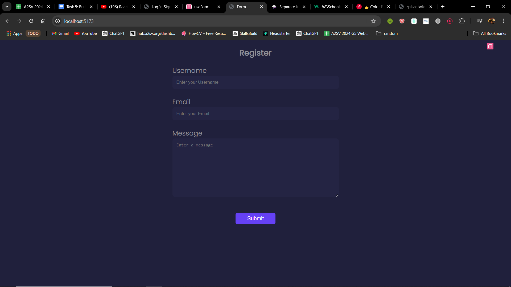
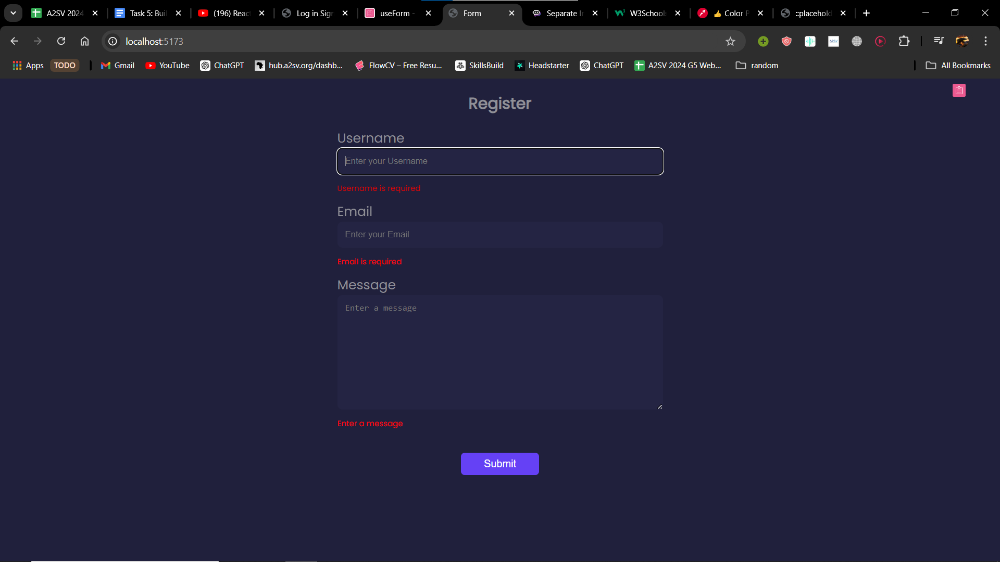
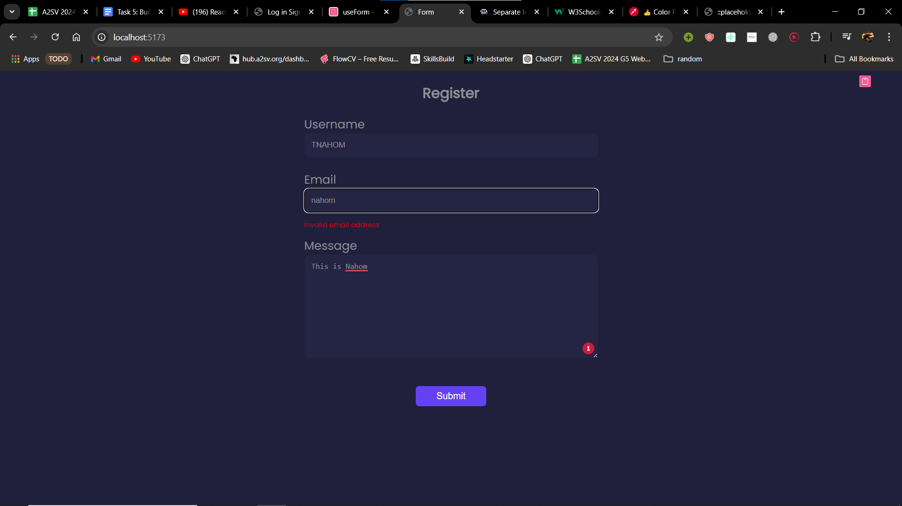

#   Task-5 FormValidation using React + TypeScript + Vite

This is a form that includes validation the validations are
  
* Required:
    - If the user doesnt enter a value to the input and submit
    - 
* Email validation:
    - If the user doesn't enter in the appropriate format
    -   
