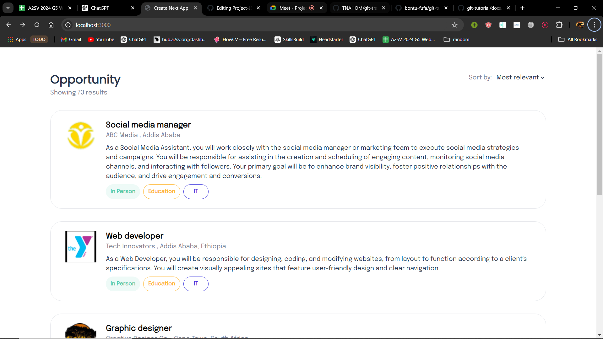
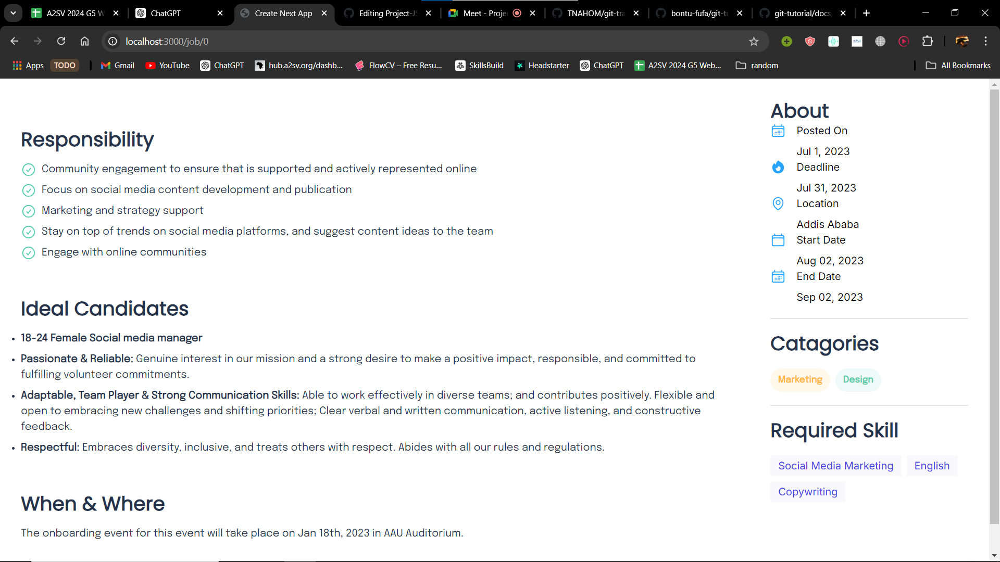
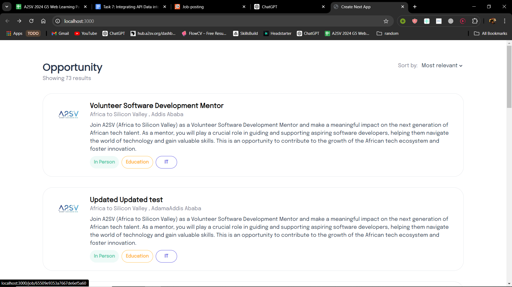
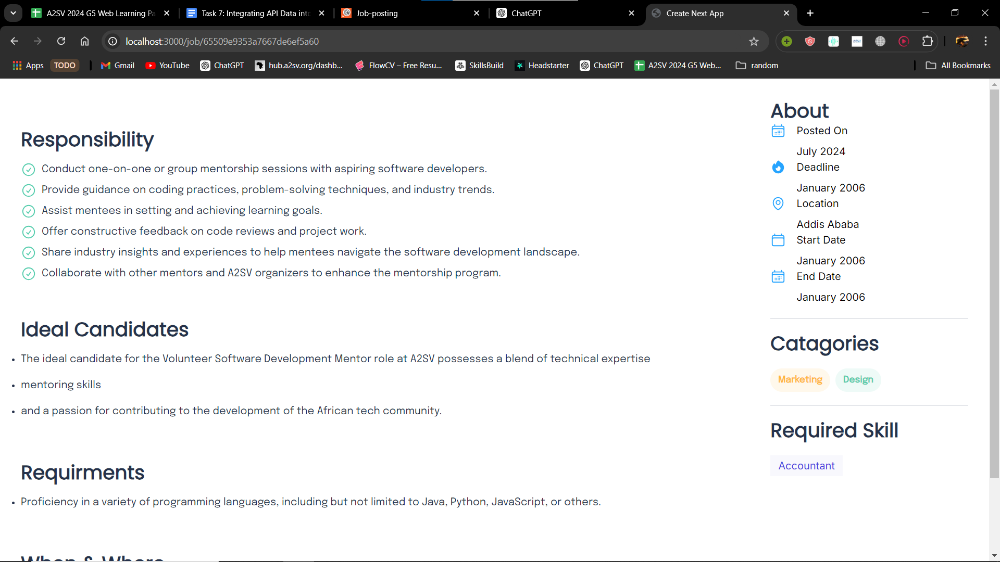
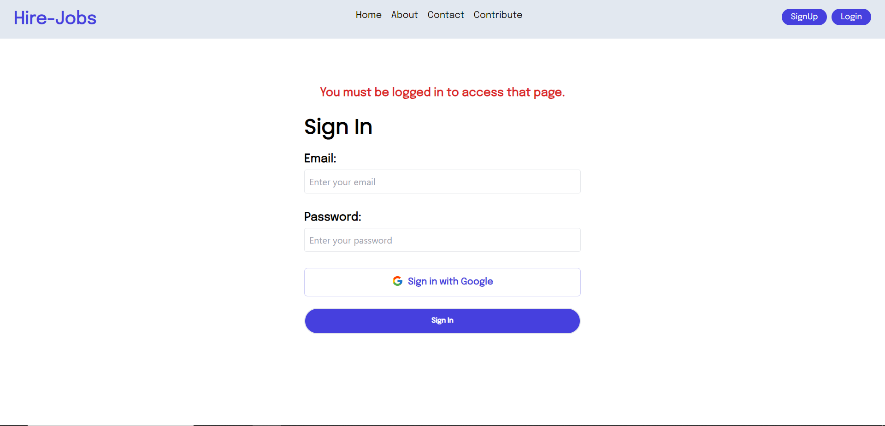
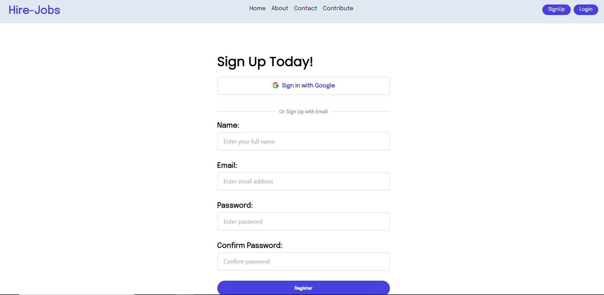
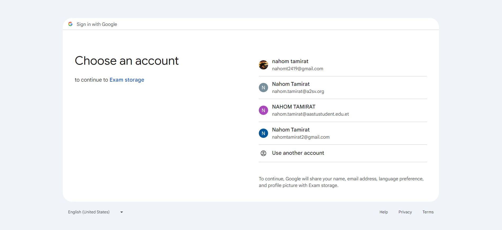
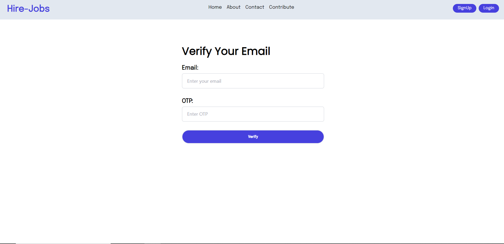

# Getting Started

First, run the development server:

```bash
npm run dev
```

Open [http://localhost:3000](http://localhost:3000) with your browser to see the result.

You can start editing the page by modifying `app/page.tsx`. The page auto-updates as you edit the file.

This project uses [`next/font`](https://nextjs.org/docs/basic-features/font-optimization) to automatically optimize and load Inter, a custom Google Font.

## Job-Posting site : Used NextJs, Typescript 
  ### (Version 2 with the api is the at the bottom)
  ### Features Version 1:
  - Job Listing(Dashboard)
    - 
  - Job Details
    - 

    
  ### Version 2
  - Job Listing(Dashboard)
    - 
  - Job Details
    - 

  ### Version 3
  - Login: access this page if the user is not signed in or if try to access the page without authentication
    - 
  - SignUp:
    - 
    - 
  - OTP -> email verification
      -  
