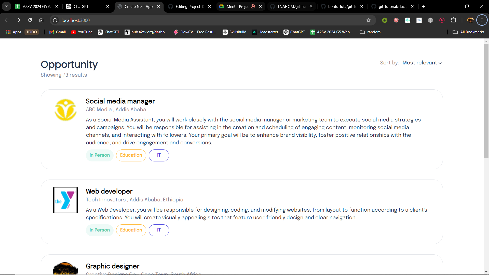
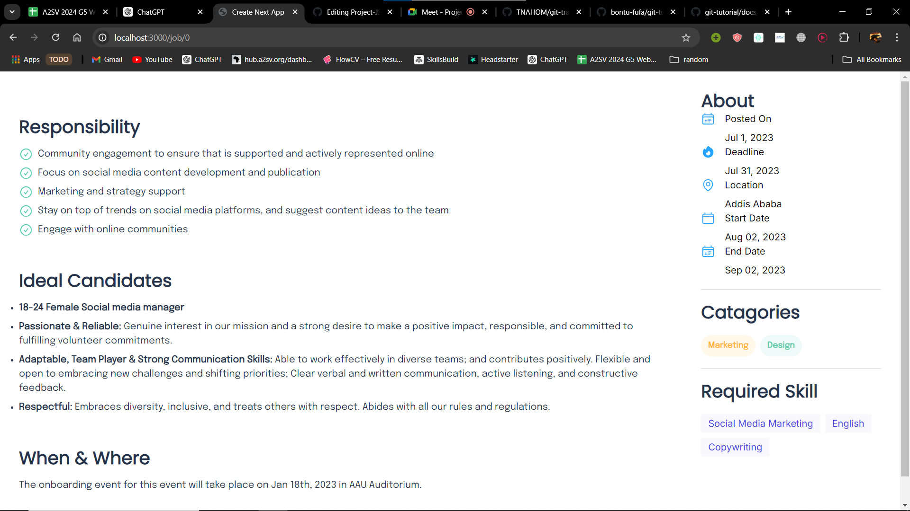
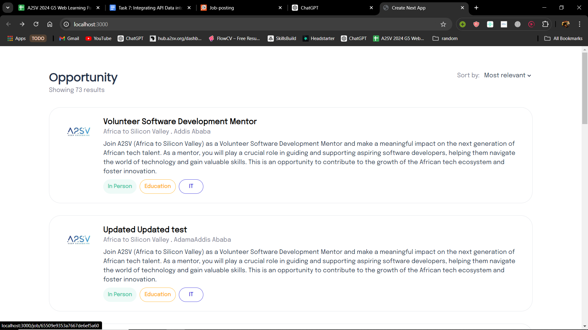
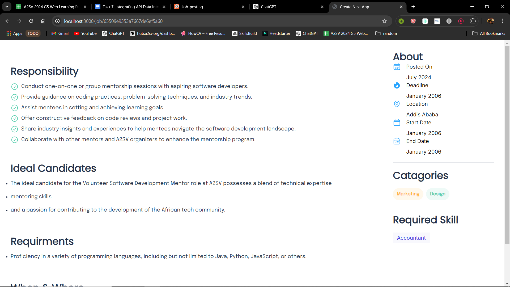
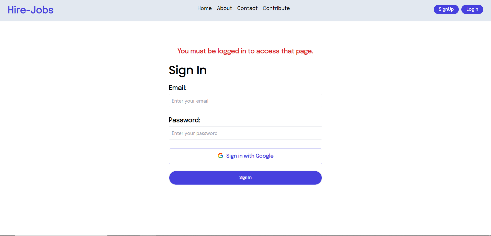
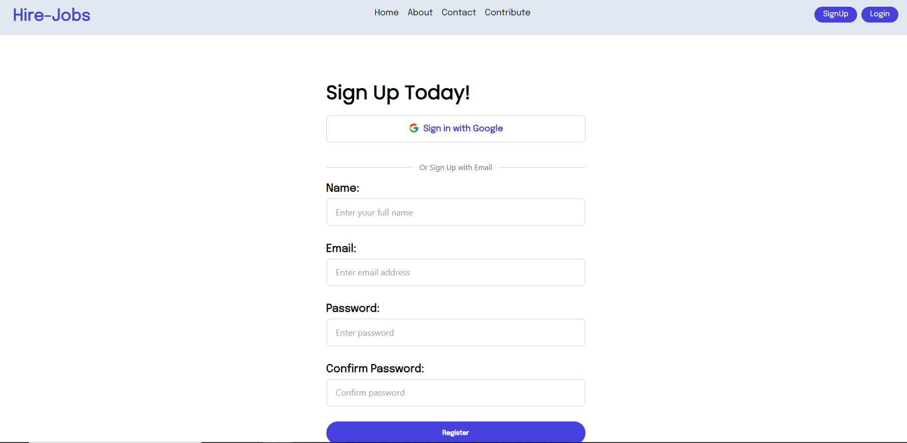
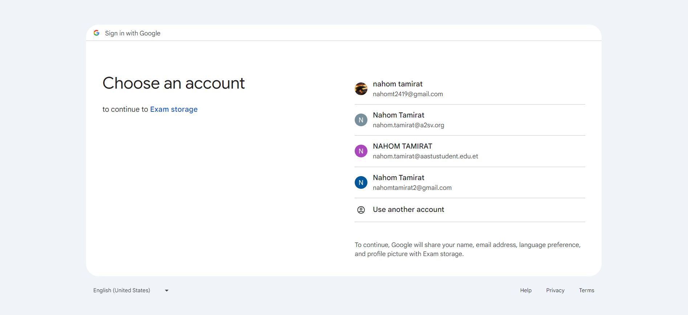
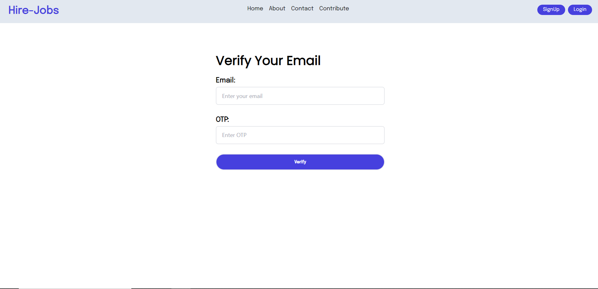
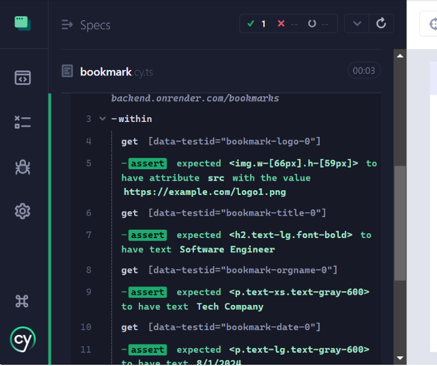
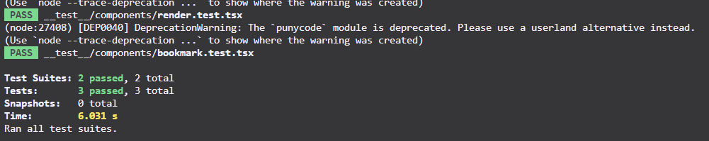

# Getting Started

First, run the development server:

```bash
npm run dev
```

Open [http://localhost:3000](http://localhost:3000) with your browser to see the result.

## Job-Posting site : Used NextJs, Typescript 
  ### Version 4 Added testing(cypress, and jest) 
  ### Version 3 Added authentication(signin and login)
  ### Version 2 connected to an API endpoint
  ### Version 1 Done the design with dummy data(json)

  
  ## Features Version 1:
  - Job Listing(Dashboard)
    - 
  - Job Details
    - 

    
  ## Version 2
  - Job Listing(Dashboard)
    - 
  - Job Details
    - 

  ## Version 3
  - Login: access this page if the user is not signed in or if try to access the page without authentication
    - 
  - SignUp:
    - 
    - 
  - OTP -> email verification
      -  

  ## Version 4
  - Cypress: End to end testing
    - 
  - Jest: Component testing
    - 


